# 요구사항 분석서

**프로젝트 명:** Travel : AI 기반 여행 경비 최적화 및 실시간 항공권 가격 변동 예측

**문서번호:** [Travel]요구사항분석서_20260514_Doc-003

**소 속:**

**팀 명:**

**팀 원:** 2022125042 이승준

---

## 제/개정 이력
| 버전 | 날짜 | 작성자 성명 | 제/개정사항 | 비고 |
| :--- | :--- | :--- | :--- | :--- |
| 1.0 | 2026.05.14 | 이승준 | 요구사항 분석서 초안 작성 | |
| 1.1 | 2026.05.18 | 이승준 | 피드백 반영: 사용자 인터페이스 항목 추가, 로그인·회원가입을 클래스 대신 사용자/사용자DB 책임으로 통합 | |
| 1.2 | 2026.05.18 | 이승준 | 피드백 반영: U_02 로그인 실패 흐름에서 아이디 찾기 서브플로우 분리, U_11 알림 설정 유스케이스 신규 추가, U_07이 알림 설정을 선행 확인하도록 수정 | |

---

## 목 차

1. 서론
   1.1 목적 및 범위
   1.2 용어 정의
   1.3 참조 문서
2. 시스템 개요
   2.1 소프트웨어 컨텍스트(Context)
   2.2 기능 분류 및 설명
3. 요구사항 명세
   3.1 정적 분석
   3.2 CRC 카드
   3.3 동적 분석
4. 인터페이스 분석
5. 제약사항
6. 요구사항 추적표
7. 참고문헌 및 부록

---

## 1. 서론

### 1.1 목적 및 범위
이 문서는 'Travel : AI 기반 여행 경비 최적화 및 실시간 항공권 가격 변동 예측' 프로젝트에서 요구되는 사항들을 분석하고 명세하는 문서이다. 본 문서는 시스템 개요와 함께 기능적, 비기능적, 인터페이스 요구사항을 정적·동적 관점에서 분석하여 정의한다.

### 1.2 용어 정의
본 문서의 이해를 돕기 위해 사용된 모든 용어 및 약어를 설명하고 정의한다.

| 용어 | 설명 |
| :--- | :--- |
| 실시간 가격 계산 시스템 | 항공권, 환율, 현지 물가 데이터를 실시간으로 수집하여 전체 여행 예산을 산출하는 본 프로젝트의 핵심 엔진 |
| 가격 예측 모델 | 과거 항공권 시계열 데이터를 학습하여 향후 가격의 상승/하락 가능성을 확률적으로 산출하는 딥러닝 기반 모델 |
| 환율 저점 알림 | 최근 3개월 데이터 대비 현재 환율이 유리한 구간일 때 사용자에게 전송되는 푸시 알림 |
| 동기화 (Synchronization) | 오프라인 모드에서 기록된 로컬 데이터와 서버의 실시간 데이터가 충돌 없이 일치되도록 맞추는 과정 |
| API | 응용 프로그램에서 사용할 수 있도록 외부 서비스(항공권, 환율 등)가 제공하는 기능을 제어할 수 있게 만든 인터페이스 |

### 1.3 참조 문서
* [Travel]프로젝트관리계획서_20260424_Doc-001
* [Travel]요구사항정의서_20260424_Doc-002
* Software Engineering assignment1
* Software Engineering assignment2

---

## 2. 시스템 개요

### 2.1 소프트웨어 컨텍스트(Context)

#### 2.1.1 Actor Table
| Actor | Role |
| :--- | :--- |
| 사용자 | 본 시스템을 사용하여 여행 계획을 수립하고 예산을 관리하는 일반 사용자를 말한다. |
| 시스템 | 항공권 가격 예측, 환율 모니터링, 예산 분배 및 알림을 사용자에게 제공하는 본 시스템을 말한다. |
| 외부 API | 항공권 가격, 실시간 환율, 도시별 물가 데이터를 제공하는 외부 시스템을 말한다. |

#### 2.1.2 UseCase Diagram

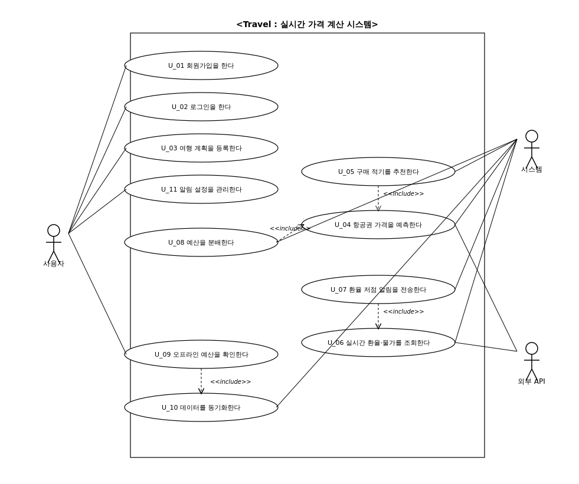

### 2.2 기능 분류 및 설명

#### 2.2.1 UseCase Description

**Use Case Name : 회원가입을 한다.    ID : U_01    Importance Level: high**

Primary Actor : 사용자
Use Case Type: Detail, essential
Brief Description : 이 Use-Case는 사용자가 본 시스템에 회원가입을 하는 Use Case를 표현한다.
Stakeholders and Interests
    사용자 : 사용자는 시스템을 이용하기 위해 회원가입 하기를 원한다.
Trigger : 사용자는 회원가입 버튼을 누른다.
Relationships
    Association : 사용자
    Include :
    Extend :
    Generalization :
Normal Flow of Events :
1. 사용자는 아이디, 비밀번호, 이메일 주소를 입력한다.
2. 사용자는 회원가입하기 버튼을 누른다.
3. 시스템은 회원가입이 성공한 경우 메인 화면으로 이동한다.

Subflows :
Alternate / Exceptional Flows :
    2.a1 : 공란이 있을 경우 시스템은 회원가입 실패 이유를 화면에 출력한다.
    2.a2 : 동일한 아이디 또는 이메일 주소가 존재할 경우 시스템은 회원가입 실패 이유를 화면에 출력한다.

---

**Use Case Name : 로그인을 한다.    ID : U_02    Importance Level: high**

Primary Actor : 사용자
Use Case Type: Detail, essential
Brief Description : 이 Use-Case는 사용자가 본 시스템에 로그인하는 Use Case를 표현한다.
Stakeholders and Interests
    사용자 : 사용자는 본인의 여행 계획에 접근하기 위해 로그인 하기를 원한다.
Trigger : 사용자는 로그인 버튼을 누른다.
Relationships
    Association : 사용자
    Include :
    Extend :
    Generalization :
Normal Flow of Events :
1. 사용자는 아이디, 비밀번호를 입력한다.
2. 사용자는 로그인하기 버튼을 누른다.
3-1. 만약 로그인이 성공했다면
        S-1 : 로그인 성공
3-2. 만약 로그인이 실패했다면
        S-2 : 로그인 실패

Subflows :
    S-1: 로그인 성공
        1. 시스템은 메인 화면으로 이동한다.
    S-2: 로그인 실패
        1. 시스템은 로그인 실패 이유를 화면에 출력한다.
        2-1. 만약 사용자가 아이디 찾기를 선택한다면
                S-2a : 아이디 찾기
        2-2. 만약 사용자가 비밀번호 찾기를 선택한다면
                S-2b : 비밀번호 찾기
    S-2a: 아이디 찾기
        1. 사용자는 아이디 찾기 버튼을 누른다.
        2. 사용자는 가입 시 등록한 이메일 주소를 입력한다.
        3. 사용자는 전송 버튼을 누른다.
        4. 시스템은 입력된 이메일에 해당하는 회원이 존재하는지 확인한다.
        5. 시스템은 해당 이메일로 가입된 아이디를 전송한다.
    S-2b: 비밀번호 찾기
        1. 사용자는 비밀번호 찾기 버튼을 누른다.
        2. 사용자는 가입 시 등록한 이메일 주소를 입력한다.
        3. 사용자는 전송 버튼을 누른다.
        4. 시스템은 입력된 이메일에 해당하는 회원이 존재하는지 확인한다.
        5. 시스템은 해당 이메일로 임시 비밀번호를 전송한다.

Alternate / Exceptional Flows :
    S-2a.4.a1 : 입력된 이메일이 회원 정보에 존재하지 않을 경우 시스템은 조회 실패 안내 메시지를 출력한다.
    S-2b.4.a1 : 입력된 이메일이 회원 정보에 존재하지 않을 경우 시스템은 조회 실패 안내 메시지를 출력한다.

---

**Use Case Name : 여행 계획을 등록한다.    ID : U_03    Importance Level: high**

Primary Actor : 사용자
Use Case Type: Detail, essential
Brief Description : 이 Use-Case는 사용자가 목적지, 여행 기간, 총 예산 등 여행 계획 정보를 등록하는 Use Case를 표현한다.
Stakeholders and Interests
    사용자 : 사용자는 자신이 떠나려는 여행의 기본 정보를 시스템에 입력하여 예산 산출의 기반을 마련하기를 원한다.
Trigger : 사용자는 여행 계획 등록 버튼을 누른다.
Relationships
    Association : 사용자
    Include :
    Extend :
    Generalization :
Normal Flow of Events :
1. 사용자는 출발지, 목적지, 출발/도착 날짜, 총 예산을 입력한다.
2. 사용자는 등록하기 버튼을 누른다.
3. 시스템은 입력된 여행 계획 정보를 저장한다.

Subflows :
Alternate / Exceptional Flows :
    2.a1 : 공란이 있을 경우 시스템은 등록 실패 이유를 화면에 출력한다.
    2.a2 : 출발 날짜가 도착 날짜보다 늦을 경우 시스템은 등록 실패 이유를 화면에 출력한다.

---

**Use Case Name : 항공권 가격을 예측한다.    ID : U_04    Importance Level: high**

Primary Actor : 시스템
Use Case Type: Detail, essential
Brief Description : 이 Use-Case는 시스템이 과거 항공권 가격 데이터를 분석하여 향후 가격 변동 추이를 예측하는 Use Case를 표현한다.
Stakeholders and Interests
    시스템 : 본 시스템은 사용자가 등록한 노선에 대한 가격 변동 확률을 산출한다.
Trigger : 사용자가 여행 계획을 등록하거나 새로고침을 요청한다.
Relationships
    Association : 시스템, 외부 API
    Include :
    Extend :
    Generalization :
Normal Flow of Events :
1. 시스템은 외부 API로부터 해당 노선의 과거 가격 데이터를 수집한다.
2. 시스템은 수집된 데이터를 가격 예측 모델에 입력한다.
3. 시스템은 향후 가격의 상승/하락 확률을 산출하여 저장한다.

Subflows :
Alternate / Exceptional Flows :
    1.a1 : 외부 API 호출에 실패한 경우 시스템은 로컬에 캐싱된 직전 데이터를 사용하여 예측을 수행한다.

---

**Use Case Name : 구매 적기를 추천한다.    ID : U_05    Importance Level: high**

Primary Actor : 시스템
Use Case Type: Detail, essential
Brief Description : 이 Use-Case는 예측된 가격 변동 데이터를 기반으로 사용자에게 항공권 구매 적기를 추천하는 Use Case를 표현한다.
Stakeholders and Interests
    시스템 : 본 시스템은 사용자가 최적의 시점에 항공권을 구매할 수 있도록 추천한다.
Trigger : 가격 예측이 완료되거나 사용자가 추천 화면에 진입한다.
Relationships
    Association : 시스템
    Include : 항공권 가격을 예측한다.
    Extend :
    Generalization :
Normal Flow of Events :
1. 시스템은 가격 예측 결과를 조회한다.
2. 시스템은 출발일 대비 잔여 기간 내 최저 예상가가 형성될 시점을 산출한다.
3. 시스템은 사용자에게 추천 구매일과 예상 가격을 표시한다.

Subflows :
Alternate / Exceptional Flows :
    1.a1 : 예측 결과가 존재하지 않을 경우 시스템은 추천 화면에 안내 메시지를 출력한다.

---

**Use Case Name : 실시간 환율·물가를 조회한다.    ID : U_06    Importance Level: high**

Primary Actor : 시스템
Use Case Type: Detail, essential
Brief Description : 이 Use-Case는 시스템이 외부 API를 통해 실시간 환율 및 도시별 물가 데이터를 조회하여 예상 비용 산출에 활용하는 Use Case를 표현한다.
Stakeholders and Interests
    시스템 : 본 시스템은 현재 시점의 환율과 물가를 반영하여 정밀한 예상 비용을 제공한다.
Trigger : 사용자가 예산 화면을 열거나 일정 주기가 도래한다.
Relationships
    Association : 시스템, 외부 API
    Include :
    Extend :
    Generalization :
Normal Flow of Events :
1. 시스템은 외부 환율 API로부터 목표 국가 통화의 실시간 환율을 수집한다.
2. 시스템은 외부 물가 API로부터 목적지 도시의 평균 숙박비, 식비, 교통비 데이터를 수집한다.
3. 시스템은 수집된 데이터를 통합하여 예상 비용 산출의 기준값으로 저장한다.

Subflows :
Alternate / Exceptional Flows :
    1.a1 : 외부 API 응답이 지연되거나 실패한 경우 시스템은 마지막으로 갱신된 캐시 데이터를 사용한다.

---

**Use Case Name : 환율 저점 알림을 전송한다.    ID : U_07    Importance Level: high**

Primary Actor : 시스템
Use Case Type: Detail, essential
Brief Description : 이 Use-Case는 시스템이 사용자의 알림 설정을 확인한 뒤, 목표 국가의 환율을 모니터링하다가 저점 구간에 도달했을 때 사용자에게 알림을 전송하는 Use Case를 표현한다.
Stakeholders and Interests
    시스템 : 본 시스템은 사용자가 동의한 경우에 한하여, 유리한 시점에 환전할 수 있도록 알림을 전송한다.
Trigger : 환율 모니터링 결과 저점 조건이 충족된다.
Relationships
    Association : 시스템
    Include : 실시간 환율·물가를 조회한다., 알림 설정을 관리한다.
    Extend :
    Generalization :
Normal Flow of Events :
1. 시스템은 사용자의 알림 수신 여부 및 저점 판단 기간을 조회한다.
2. 만약 알림 수신이 활성화되어 있다면, 시스템은 사용자가 지정한 저점 판단 기간 동안의 환율 데이터와 현재 환율을 비교한다.
3. 만약 현재 환율이 저점 구간에 해당한다면
        S-1 : 알림 전송

Subflows :
    S-1 : 알림 전송
        1. 시스템은 사용자에게 환전 권장 알림을 전송한다.

Alternate / Exceptional Flows :
    1.a1 : 사용자의 알림 수신이 비활성화되어 있을 경우 시스템은 알림 전송을 수행하지 않는다.

---

**Use Case Name : 예산을 분배한다.    ID : U_08    Importance Level: high**

Primary Actor : 시스템
Use Case Type: Detail, essential
Brief Description : 이 Use-Case는 시스템이 총 예산에서 예측된 항공권 비용을 차감한 후 남은 금액을 일일 평균 경비로 자동 분배하는 Use Case를 표현한다.
Stakeholders and Interests
    시스템 : 본 시스템은 사용자가 가용 예산을 합리적으로 사용할 수 있도록 일일 경비를 분배한다.
Trigger : 사용자가 예산 화면에 진입하거나 항공권 예측 결과가 갱신된다.
Relationships
    Association : 시스템
    Include : 항공권 가격을 예측한다.
    Extend :
    Generalization :
Normal Flow of Events :
1. 시스템은 사용자가 등록한 총 예산과 여행 일수를 조회한다.
2. 시스템은 예측된 항공권 비용을 총 예산에서 차감한다.
3. 시스템은 차감 후 남은 금액을 여행 일수로 나누어 일일 평균 경비를 산출한다.
4. 시스템은 일일 평균 경비를 숙박비, 식비, 교통비 항목으로 분배하여 화면에 표시한다.

Subflows :
Alternate / Exceptional Flows :
    2.a1 : 예측된 항공권 비용이 총 예산을 초과할 경우 시스템은 사용자에게 예산 부족 경고 메시지를 출력한다.

---

**Use Case Name : 오프라인 예산을 확인한다.    ID : U_09    Importance Level: high**

Primary Actor : 사용자
Use Case Type: Detail, essential
Brief Description : 이 Use-Case는 사용자가 네트워크 연결이 불안정한 환경에서 로컬에 저장된 예산 데이터를 확인하는 Use Case를 표현한다.
Stakeholders and Interests
    사용자 : 사용자는 해외 현지 등 네트워크가 불안정한 환경에서도 예산 데이터를 확인하기를 원한다.
Trigger : 사용자가 오프라인 상태에서 앱을 실행한다.
Relationships
    Association : 사용자
    Include : 데이터를 동기화한다.
    Extend :
    Generalization :
Normal Flow of Events :
1. 사용자는 오프라인 상태에서 앱을 실행한다.
2. 시스템은 로컬 저장소에 저장된 가장 최근 예산 데이터를 불러온다.
3. 사용자는 일일 경비, 잔여 예산, 환율 정보를 확인할 수 있다.

Subflows :
Alternate / Exceptional Flows :
    2.a1 : 로컬 저장소에 데이터가 존재하지 않을 경우 시스템은 네트워크 연결 후 재시도 안내 메시지를 출력한다.

---

**Use Case Name : 데이터를 동기화한다.    ID : U_10    Importance Level: mid**

Primary Actor : 시스템
Use Case Type: Detail, essential
Brief Description : 이 Use-Case는 시스템이 오프라인 모드에서 변경된 로컬 데이터와 서버의 실시간 데이터를 충돌 없이 동기화하는 Use Case를 표현한다.
Stakeholders and Interests
    시스템 : 본 시스템은 네트워크 재연결 시 로컬과 서버 데이터의 일관성을 유지한다.
Trigger : 네트워크가 재연결된다.
Relationships
    Association : 시스템
    Include :
    Extend :
    Generalization :
Normal Flow of Events :
1. 시스템은 네트워크 재연결을 감지한다.
2. 시스템은 로컬 저장소의 변경 이력과 서버의 데이터를 비교한다.
3. 시스템은 충돌이 없는 변경 사항을 서버에 반영한다.
4. 시스템은 서버의 최신 환율·물가·예측 데이터를 로컬 저장소에 갱신한다.

Subflows :
Alternate / Exceptional Flows :
    3.a1 : 데이터 충돌이 발생한 경우 시스템은 최신 타임스탬프를 기준으로 우선순위를 결정한다.

---

**Use Case Name : 알림 설정을 관리한다.    ID : U_11    Importance Level: mid**

Primary Actor : 사용자
Use Case Type: Detail, essential
Brief Description : 이 Use-Case는 사용자가 환율 저점 알림의 수신 여부 및 알림 조건(저점 판단 기간 등)을 직접 설정하는 Use Case를 표현한다.
Stakeholders and Interests
    사용자 : 사용자는 본인의 의사에 따라 알림 수신 여부 및 조건을 직접 제어하기를 원한다.
Trigger : 사용자는 알림 설정 화면에 진입한다.
Relationships
    Association : 사용자
    Include :
    Extend :
    Generalization :
Normal Flow of Events :
1. 사용자는 알림 설정 화면에 진입한다.
2. 사용자는 환율 저점 알림 수신 여부(켜기/끄기)를 선택한다.
3. 만약 사용자가 알림 수신을 켰다면, 사용자는 저점 판단 기간(예: 1·3·6개월)을 선택한다.
4. 사용자는 저장 버튼을 누른다.
5. 시스템은 변경된 알림 설정을 사용자DB에 저장한다.
6. 시스템은 저장 완료 메시지를 화면에 출력한다.

Subflows :
Alternate / Exceptional Flows :
    5.a1 : 알림 설정 저장에 실패한 경우 시스템은 실패 사유를 화면에 출력하고 변경 사항을 롤백한다.

---

## 3. 요구사항 명세

### 3.1 정적 분석

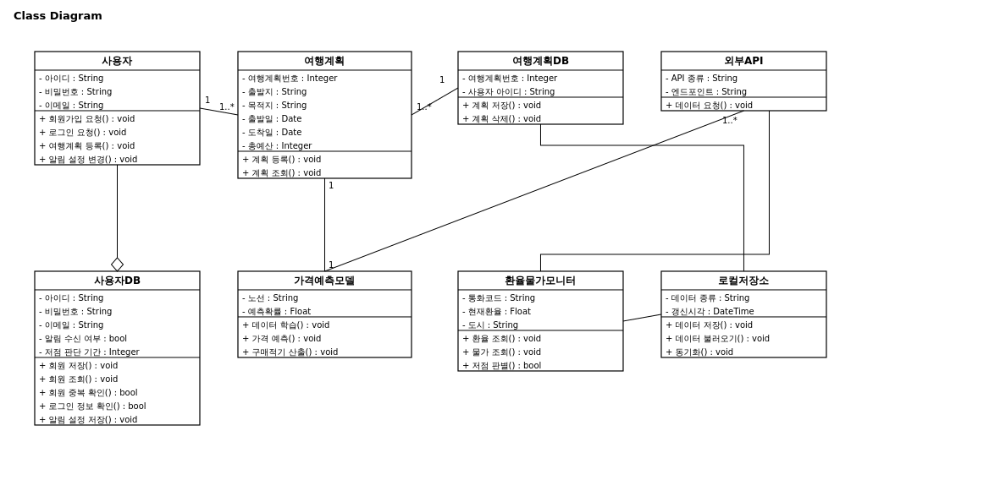

### 3.2 CRC 카드

**Class Name: 사용자    ID: 01    Type: Concrete, Domain**

Description:
본 시스템을 사용하여 여행 계획을 수립하고 예산을 관리하는 사람을 나타낸다.

Associated Use Case: U_01, U_02, U_03, U_09, U_11

| Responsibilities | Collaborators |
| :--- | :--- |
| 회원가입 요청() : void | 사용자DB |
| 로그인 요청() : void | 사용자DB |
| 여행계획 등록() : void | 여행계획 |
| 알림 설정 변경() : void | 사용자DB |

Attributes
 - 아이디 : String
 - 비밀번호 : String
 - 이메일 : String

Relationships
 - Generalization (a-kind-of):
 - Aggregation (has-parts):
 - Other Associations: 여행계획, 사용자DB

---

**Class Name: 사용자DB    ID: 02    Type: Concrete, Domain**

Description:
회원으로 가입한 사용자의 정보 및 알림 설정을 저장하고, 회원가입 시 중복 여부와 로그인 시 인증 정보를 검증하는 데이터베이스를 나타낸다.

Associated Use Case: U_01, U_02, U_07, U_11

| Responsibilities | Collaborators |
| :--- | :--- |
| 회원 저장() : void | 사용자 |
| 회원 조회() : void | 사용자 |
| 회원 중복 확인() : bool | 사용자 |
| 로그인 정보 확인() : bool | 사용자 |
| 알림 설정 저장() : void | 사용자 |

Attributes
 - 아이디 : String
 - 비밀번호 : String
 - 이메일 : String
 - 알림 수신 여부 : bool
 - 저점 판단 기간 : Integer

Relationships
 - Generalization (a-kind-of):
 - Aggregation (has-parts): 사용자
 - Other Associations: 환율물가모니터

---

**Class Name: 여행계획    ID: 03    Type: Concrete, Domain**

Description:
사용자가 등록한 출발지, 목적지, 기간, 예산 등 여행 계획 정보를 나타낸다.

Associated Use Case: U_03, U_05, U_08

| Responsibilities | Collaborators |
| :--- | :--- |
| 계획 등록() : void | 사용자, 여행계획DB |
| 계획 조회() : void | 사용자, 여행계획DB |

Attributes
 - 여행계획번호 : Integer
 - 출발지 : String
 - 목적지 : String
 - 출발일 : Date
 - 도착일 : Date
 - 총예산 : Integer

Relationships
 - Generalization (a-kind-of):
 - Aggregation (has-parts):
 - Other Associations: 사용자, 가격예측모델, 환율물가모니터, 로컬저장소

---

**Class Name: 여행계획DB    ID: 04    Type: Concrete, Domain**

Description:
사용자가 등록한 여행 계획을 저장하는 데이터베이스를 나타낸다.

Associated Use Case: U_03

| Responsibilities | Collaborators |
| :--- | :--- |
| 계획 저장() : void | 여행계획 |
| 계획 삭제() : void | 여행계획 |

Attributes
 - 여행계획번호 : Integer
 - 사용자 아이디 : String

Relationships
 - Generalization (a-kind-of):
 - Aggregation (has-parts): 여행계획
 - Other Associations:

---

**Class Name: 가격예측모델    ID: 05    Type: Concrete, Domain**

Description:
과거 항공권 가격 데이터를 학습하여 향후 가격 변동을 예측하고 구매 적기를 산출하는 딥러닝 모델을 나타낸다.

Associated Use Case: U_04, U_05, U_08

| Responsibilities | Collaborators |
| :--- | :--- |
| 데이터 학습() : void | 외부API |
| 가격 예측() : void | 외부API, 여행계획 |
| 구매적기 산출() : void | 여행계획 |

Attributes
 - 노선 : String
 - 예측확률 : Float

Relationships
 - Generalization (a-kind-of):
 - Aggregation (has-parts):
 - Other Associations: 외부API, 여행계획

---

**Class Name: 환율물가모니터    ID: 06    Type: Concrete, Domain**

Description:
실시간 환율과 도시별 물가를 모니터링하고 환율 저점 구간을 판별하는 컴포넌트를 나타낸다.

Associated Use Case: U_06, U_07

| Responsibilities | Collaborators |
| :--- | :--- |
| 환율 조회() : void | 외부API |
| 물가 조회() : void | 외부API |
| 저점 판별() : bool | 사용자 |

Attributes
 - 통화코드 : String
 - 현재환율 : Float
 - 도시 : String

Relationships
 - Generalization (a-kind-of):
 - Aggregation (has-parts):
 - Other Associations: 외부API, 여행계획

---

**Class Name: 외부API    ID: 07    Type: Concrete, Domain**

Description:
항공권 가격, 실시간 환율, 도시별 물가 데이터를 제공하는 외부 시스템을 나타낸다.

Associated Use Case: U_04, U_06

| Responsibilities | Collaborators |
| :--- | :--- |
| 데이터 요청() : void | 가격예측모델, 환율물가모니터 |

Attributes
 - API 종류 : String
 - 엔드포인트 : String

Relationships
 - Generalization (a-kind-of):
 - Aggregation (has-parts):
 - Other Associations: 가격예측모델, 환율물가모니터

---

**Class Name: 로컬저장소    ID: 08    Type: Concrete, Domain**

Description:
오프라인 환경에서 예산 및 환율 데이터를 열람할 수 있도록 기기에 데이터를 저장하고 서버와 동기화하는 컴포넌트를 나타낸다.

Associated Use Case: U_09, U_10

| Responsibilities | Collaborators |
| :--- | :--- |
| 데이터 저장() : void | 여행계획 |
| 데이터 불러오기() : void | 사용자 |
| 동기화() : void | 여행계획DB |

Attributes
 - 데이터 종류 : String
 - 갱신시각 : DateTime

Relationships
 - Generalization (a-kind-of):
 - Aggregation (has-parts):
 - Other Associations: 여행계획, 여행계획DB

---

### 3.3 동적 분석

#### 3.3.1 회원가입을 한다.

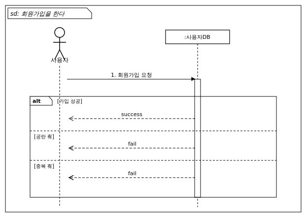

#### 3.3.2 로그인을 한다.

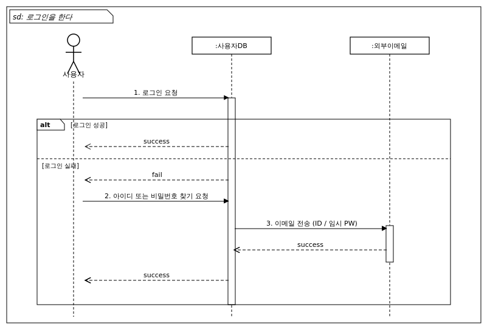

#### 3.3.3 여행 계획을 등록한다.

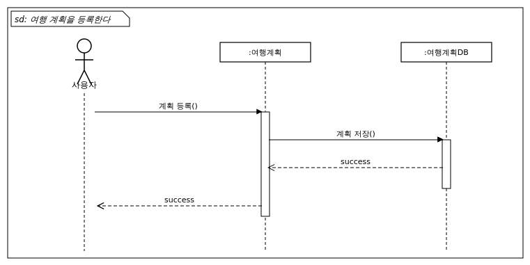

#### 3.3.4 항공권 가격을 예측한다.

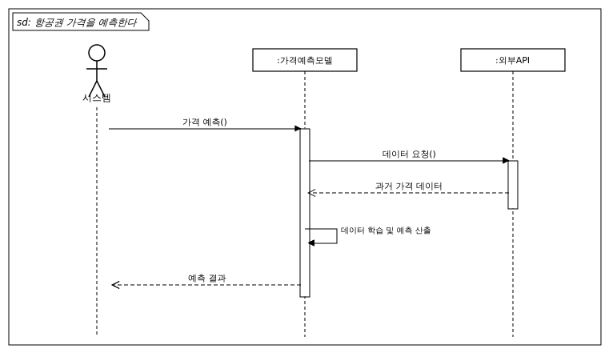

#### 3.3.5 구매 적기를 추천한다.

#### 3.3.6 실시간 환율·물가를 조회한다.

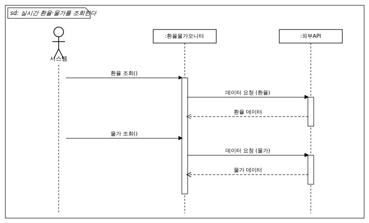

#### 3.3.7 환율 저점 알림을 전송한다.

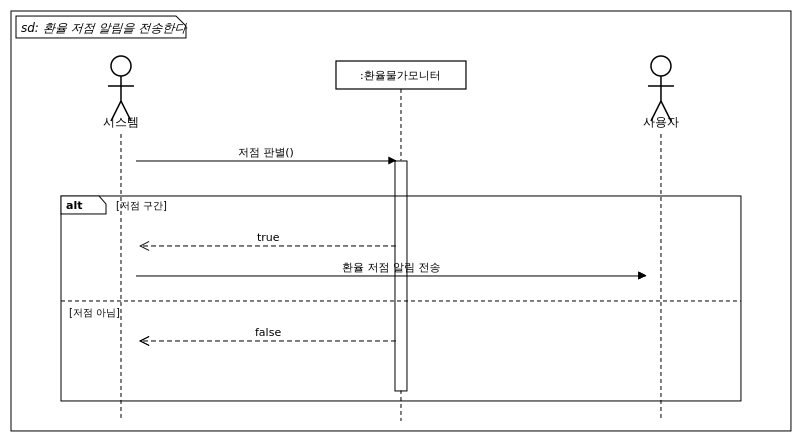

#### 3.3.8 예산을 분배한다.

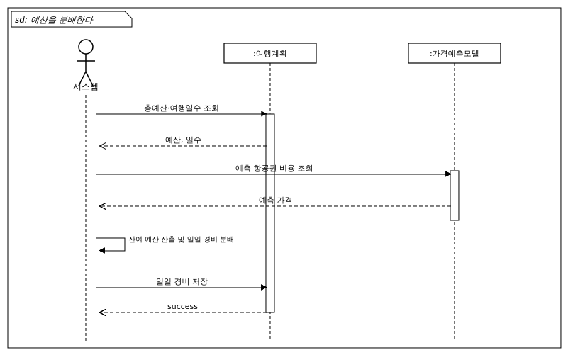

#### 3.3.9 오프라인 예산을 확인한다.

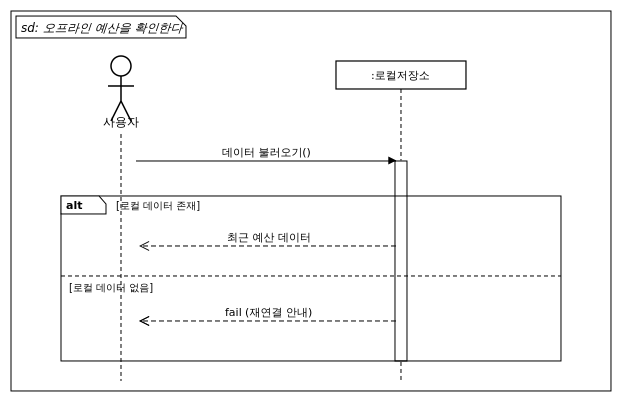

#### 3.3.10 데이터를 동기화한다.

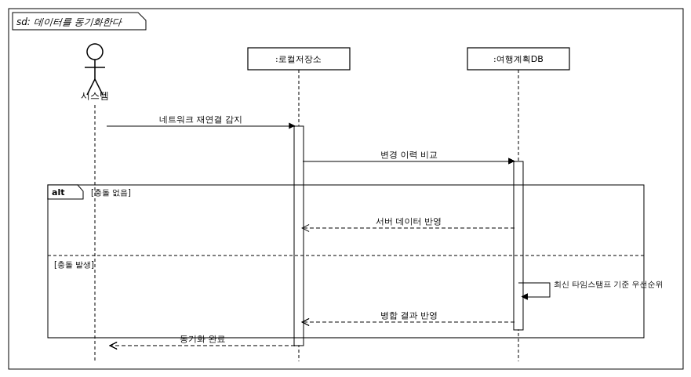

#### 3.3.11 알림 설정을 관리한다.

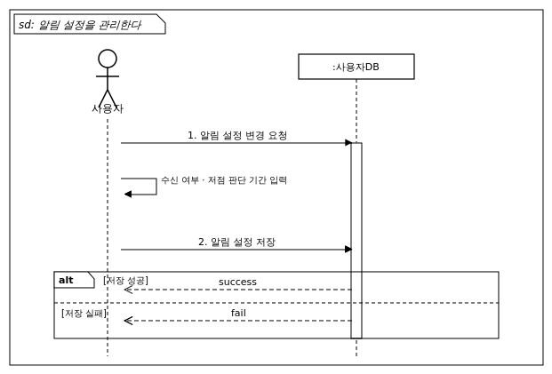

---

## 4. 인터페이스 분석

### 4.1 사용자 인터페이스 (User Interface)

| 분류 | 요구사항 |
| :--- | :--- |
| UI-001 | 시스템은 회원가입 및 로그인 화면을 제공한다. 화면에는 아이디·비밀번호 입력 폼과 이메일을 통한 비밀번호 찾기 기능이 포함된다. |
| UI-002 | 시스템은 여행 계획 등록 화면을 제공한다. 화면에는 출발지, 목적지, 출발/도착일, 총 예산을 입력할 수 있는 폼이 포함된다. |
| UI-003 | 시스템은 예산 현황 대시보드를 제공한다. 대시보드에는 총 예산, 예측 항공권 비용, 잔여 예산, 일일 평균 경비(숙박·식비·교통비)가 시각적으로 표시된다. |
| UI-004 | 시스템은 항공권 가격 추이 화면을 제공한다. 화면에는 과거 가격 그래프, 예측 가격, 추천 구매일이 함께 표시된다. |
| UI-005 | 시스템은 환율·물가 정보 화면을 제공한다. 화면에는 목표 국가의 실시간 환율과 도시별 평균 물가가 표시된다. |
| UI-006 | 시스템은 환율 저점 알림을 인앱 알림 및 푸시 알림 형태로 사용자에게 표시한다. |
| UI-007 | 시스템은 오프라인 모드에서 현재 네트워크 연결 상태와 마지막 동기화 시각을 화면 상단에 명시적으로 표시한다. |
| UI-008 | 시스템은 알림 설정 화면을 제공한다. 화면에는 환율 저점 알림 수신 여부(on/off)와 저점 판단 기간 선택지가 포함된다. |

### 4.2 외부 시스템 인터페이스 (External System Interface)

| 분류 | 요구사항 |
| :--- | :--- |
| IR-001 | 시스템은 항공권 가격 조회를 위해 외부 항공권 Open API와 안정적으로 연동 가능한 인터페이스를 구성한다. |
| IR-002 | 시스템은 실시간 환율 조회를 위해 외부 환율 Open API와 안정적으로 연동 가능한 인터페이스를 구성한다. |
| IR-003 | 시스템은 도시별 물가 데이터 조회를 위해 외부 물가 Open API와 안정적으로 연동 가능한 인터페이스를 구성한다. |
| IR-004 | 시스템은 사용자에게 환율 저점 알림을 전송하기 위해 푸시 알림 인터페이스와 연동한다. |

---

## 5. 제약사항

| 분류 | 제약사항 |
| :--- | :--- |
| C-001 | 외부 Open API의 일일 호출 제한 정책에 따라 호출 횟수가 제약될 수 있다. |
| C-002 | 오프라인 모드에서 사용 가능한 데이터는 최근 동기화 시점의 데이터로 한정된다. |
| C-003 | 가격 예측 모델의 정확도는 학습 데이터의 양과 품질에 따라 변동된다. |

---

## 6. 요구사항 추적표

| 요구사항 \ UseCase | U_01 | U_02 | U_03 | U_04 | U_05 | U_06 | U_07 | U_08 | U_09 | U_10 | U_11 |
| :--- | :---: | :---: | :---: | :---: | :---: | :---: | :---: | :---: | :---: | :---: | :---: |
| FR-001 (실시간 환율/물가 수집·계산) |  |  |  |  |  | O |  | O |  |  |  |
| FR-002 (과거 데이터 기반 가격 예측) |  |  |  | O |  |  |  |  |  |  |  |
| FR-003 (구매 적기 도출 및 제시) |  |  |  |  | O |  |  |  |  |  |  |
| FR-004 (환율 추이 모니터링) |  |  |  |  |  | O | O |  |  |  |  |
| FR-005 (저점 구간 알림 제공) |  |  |  |  |  |  | O |  |  |  |  |
| FR-006 (항공권 비용 차감) |  |  |  |  |  |  |  | O |  |  |  |
| FR-007 (일일 평균 경비 자동 분배) |  |  |  |  |  |  |  | O |  |  |  |
| FR-008 (오프라인 로컬 저장) |  |  | O |  |  |  |  |  | O | O |  |
| FR-009 (회원가입) | O |  |  |  |  |  |  |  |  |  |  |
| FR-010 (로그인) |  | O |  |  |  |  |  |  |  |  |  |
| FR-011 (여행 계획 등록) |  |  | O |  |  |  |  |  |  |  |  |
| FR-012 (알림 설정 관리) |  |  |  |  |  |  | O |  |  |  | O |
| NFR-001 (오프라인-서버 동기화) |  |  |  |  |  |  |  |  | O | O |  |
| NFR-002 (외부 API 유연 대응 아키텍처) |  |  |  | O |  | O |  |  |  |  |  |
| NFR-003 (가격 예측 정확도) |  |  |  | O | O |  |  |  |  |  |  |
| NFR-004 (모델 확장성) |  |  |  | O |  |  |  |  |  |  |  |
| NFR-005 (개인정보 암호화·보안) | O | O | O |  |  |  |  |  |  |  | O |

---

## 7. 참고문헌 및 부록
해당없음
